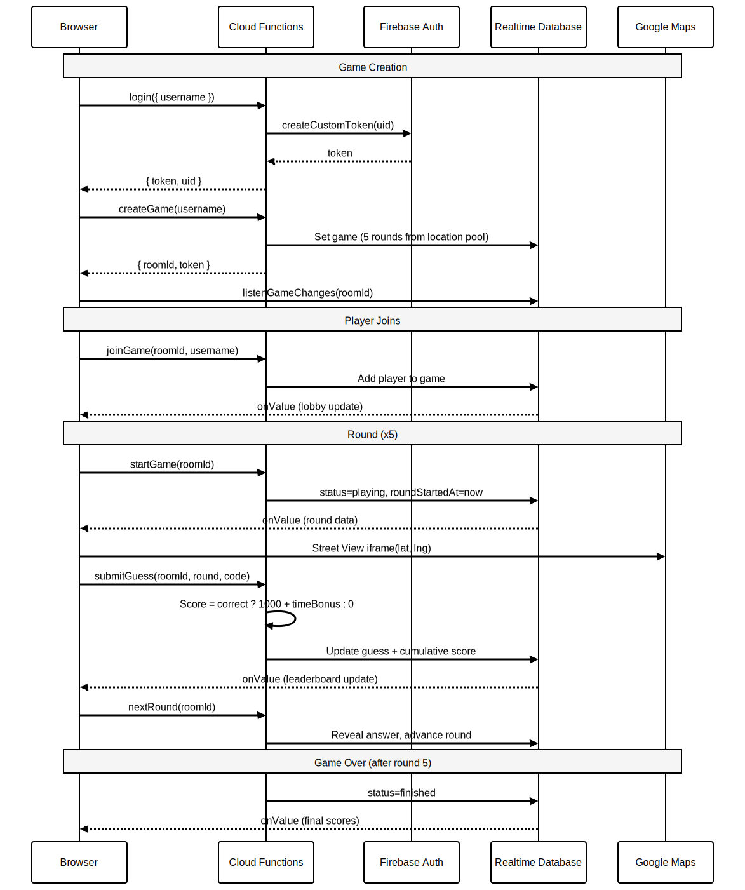

# OpenGuessr

Free, open source GeoGuessr-style multiplayer game. See a Google Street View panorama, guess which country it's from,
and compete with friends on a live leaderboard.

Vanilla JavaScript frontend with Lit web components, Firebase Cloud Functions for game logic, Realtime Database for
live state, and Vertex AI Gemini for generating random street-level locations. Deployed to Firebase Hosting.

---

## Table of Contents

- [Architecture Overview](#architecture-overview)
- [How Locations Are Sourced](#how-locations-are-sourced)
- [Scoring Logic](#scoring-logic)
- [Project Structure](#project-structure)
- [Development Setup](#development-setup)
- [Building and Testing](#building-and-testing)
- [Deployment](#deployment)
- [Environment Variables](#environment-variables)
- [Design Decisions](#design-decisions)

---

## Architecture Overview



### Request Flow

1. **Browser** loads the SPA from Firebase Hosting (CDN for static assets, SPA rewrites)
2. **Landing page** shown -- player clicks "Start a game"
3. **Auth dialog** collects a username, Cloud Functions issues a custom token (anonymous auth)
4. **Cloud Functions** create the game room with 5 random rounds from the location pool
5. **Realtime Database** streams game state to all connected players via `onValue` listeners
6. **Google Maps** renders the Street View panorama for each round in an iframe



### Game Lifecycle

A game moves through three states: **waiting**, **playing**, and **finished**. The host controls transitions.



| State     | What happens                                                                 |
|-----------|------------------------------------------------------------------------------|
| `waiting` | Host created the room. Players join via shared link. Lobby shows player list |
| `playing` | Street View shown, timer counting down, players pick flags and submit        |
| `finished`| All 5 rounds complete. Final leaderboard with winner announcement            |

Round transitions are manual -- the host clicks "Next Round" after each round. This lets the group discuss
the answer before moving on. After round 5 is revealed, the game automatically enters `finished`.

### Cloud Functions

| Function               | Auth       | Purpose                                                      |
|------------------------|------------|--------------------------------------------------------------|
| `login`                | Public     | Validate username, issue Firebase custom token               |
| `createGame`           | Required   | Create room with 5 rounds from location pool                 |
| `joinGame`             | Required   | Add player to existing room                                  |
| `startGame`            | Host       | Transition waiting to playing, start round timer             |
| `submitGuess`          | Required   | Record guess, calculate score, update cumulative total       |
| `submitMiss`           | Required   | Record timeout (no guess), score 0                           |
| `nextRound`            | Host       | Reveal answer, advance to next round or finish game          |
| `transferHost`         | Host       | Pass host role to another player (internal use)              |
| `requestHostPromotion` | Required   | Request a democratic vote to become host                     |
| `voteOnHostPromotion`  | Required   | Cast approve/reject vote on a promotion request              |
| `resolveHostPromotion` | Required   | Finalize promotion vote after timeout                        |
| `generateLocationPool` | Scheduled  | Daily Gemini-powered location generation                     |
| `seedLocationPool`     | Required   | Manual trigger to populate location pool                     |
| `cleanup`              | Scheduled  | Remove games older than 24 hours                             |

---

## How Locations Are Sourced

Each game needs 5 random street-level coordinates with confirmed Google Street View coverage. The system uses
a two-tier strategy: an AI-generated location pool as the primary source, with a static fallback.


### The Location Pool

A scheduled Cloud Function runs every 24 hours and calls **Vertex AI Gemini 2.5 Flash** to generate 50 new
coordinates. The prompt instructs Gemini to:

- Spread locations across different countries and continents
- Mix urban, suburban, and rural settings
- Avoid famous landmarks and tourist attractions
- Prefer residential streets, local roads, small towns, and ordinary neighbourhoods
- Return precise coordinates (6 decimal places) with ISO country codes

Each candidate coordinate is then validated against the **Google Maps Street View Metadata API** (in batches
of 10) to confirm actual panorama coverage exists within 1km. Only validated coordinates enter the pool.

The pool is capped at 500 entries. New entries are deduplicated against existing ones by rounding to 2 decimal
places (~1.1km precision) to avoid near-duplicates.

### Game Creation

When `createGame` is called, the function reads the location pool from Realtime Database:

- **Pool has >= 5 entries**: shuffle and pick 5 random locations
- **Pool is empty or too small**: fall back to ~100 hardcoded coordinates in `functions/locations.js`

The static fallback covers major cities across 6 continents, so games always work -- even on a fresh deployment
before the first Gemini run.

### Local Development

In emulator mode (`FUNCTIONS_EMULATOR=true`), the Gemini API is never called. Location generation returns
shuffled static locations instead, so no API keys or GCP credentials are needed for local development.

---

## Scoring Logic



Each round is scored independently. The formula rewards both **accuracy** (knowing the country) and **speed**
(guessing quickly).

### Formula

```
If correct:
  elapsed     = (now - roundStartedAt) / 1000
  remaining   = max(0, roundTime - elapsed)
  timeBonus   = round(500 * remaining / roundTime)
  score       = 1000 + timeBonus

If wrong or missed:
  score       = 0
```

### Score Ranges

| Outcome           | Points         | Example                                      |
|-------------------|----------------|----------------------------------------------|
| Correct at 0s     | 1500           | Instant guess -- full 500 time bonus          |
| Correct at 15s    | 1250           | Half the round elapsed -- 250 time bonus      |
| Correct at 30s    | 1000           | Last second -- base score only, no bonus      |
| Wrong             | 0              | Incorrect country code                        |
| Missed (timeout)  | 0              | Timer expired without a guess                 |

### Totals

- **Per round maximum**: 1500 points
- **Per game maximum**: 7500 points (5 rounds x 1500)
- **Cumulative**: each round's score is added to the player's running total in the database

The timer continues running after a player submits their guess, since other players may still be guessing.
The host decides when to advance to the next round.

---

## Project Structure

```
openguessr/
+-- .github/workflows/
|   +-- ci.yml                          # Test + build on PRs
|   +-- cd.yml                          # Deploy to Firebase
+-- diagrams/
|   +-- 01-architecture-overview.mmd    # System components
|   +-- 01-architecture-overview.svg
|   +-- 02-game-lifecycle.mmd           # State machine
|   +-- 02-game-lifecycle.svg
|   +-- 03-request-flow.mmd             # Sequence diagram
|   +-- 03-request-flow.svg
|   +-- 04-scoring-logic.mmd            # Score calculation
|   +-- 04-scoring-logic.svg
|   +-- 05-location-sourcing.mmd        # Gemini + fallback
|   +-- 05-location-sourcing.svg
+-- functions/
|   +-- index.js                        # 11 Cloud Functions
|   +-- locations.js                    # ~100 static coordinates
|   +-- gemini.js                       # Vertex AI integration
|   +-- functions.test.js               # Unit tests
|   +-- package.json
+-- public/
|   +-- assets/                         # Static images
+-- src/
|   +-- index.js                        # Entry point
|   +-- firebase-init.js                # Firebase config + emulator detection
|   +-- component/
|   |   +-- alert/                      # Toast notification service
|   |   +-- core-css/                   # Global styles (vars, reset, base)
|   |   +-- country-picker/            # <country-picker> Lit component
|   |   +-- game-over/                 # <game-over> Lit component
|   |   +-- landing/                    # Landing page (vanilla JS)
|   |   +-- leaderboard/              # <game-leaderboard> Lit component
|   |   +-- score-display/            # <score-display> Lit component
|   |   +-- shared-styles.js           # Button + input base styles
|   |   +-- street-view/              # <street-view-panel> Lit component
|   |   +-- timer/                     # <round-timer> Lit component
|   +-- data/
|   |   +-- countries.js                # Continents, flags, country lookup
|   |   +-- maps.js                     # Street View URL builder
|   |   +-- timer.js                    # Time formatting
|   +-- features/
|       +-- auth-dialog/                # Username dialog (light DOM)
|       +-- database/                   # Firebase bridge + rules tests
|       +-- game-screen/               # <game-view> Lit component (orchestrator)
+-- tests/                              # Playwright E2E tests
+-- database.rules.json                 # Realtime Database security rules
+-- firebase.json                       # Firebase configuration
+-- vite.config.js                      # Vite + Vitest config
+-- package.json
```

---

## Development Setup

### Prerequisites

- Node.js 22+
- npm 10.8+
- Firebase CLI 13+ (`npm install -g firebase-tools`)
- Java 21+ (for Firebase emulators)

### Quick Start

```bash
# Install dependencies
npm install
cd functions && npm install && cd ..

# Start dev server + Firebase emulators
npm start
```

Open http://localhost:5173. The Vite dev server proxies Firebase requests to the emulators automatically.

### DevContainer

Open in VS Code with the Dev Containers extension, or use GitHub Codespaces. The container includes
Node.js 22, Java 21, Firebase CLI, and Claude Code.

```bash
devcontainer up
devcontainer exec claude --dangerously-skip-permissions
```

### Emulator Ports

| Service            | Port |
|--------------------|------|
| Vite Dev Server    | 5173 |
| Firebase Hosting   | 5002 |
| Cloud Functions    | 5001 |
| Realtime Database  | 9001 |
| Firebase Auth      | 9099 |
| Emulator UI        | 4000 |

---

## Building and Testing

### Build

```bash
# Production build
npm run build

# Preview production build
npm run preview
```

### Test

```bash
# Unit tests + database rules tests (requires emulators)
npm test

# Interactive test mode
npm run test:watch

# Playwright E2E tests
npx playwright test
```

### Scripts Reference

| Script           | Description                              |
|------------------|------------------------------------------|
| `npm start`      | Vite dev server + Firebase emulators     |
| `npm test`       | Run all tests with emulators             |
| `npm run test:watch` | Interactive test mode with emulators |
| `npm run serve`  | Firebase emulators only                  |
| `npm run build`  | Production build to `dist/`              |
| `npm run preview`| Preview production build                 |

---

## Deployment

The project is deployed via GitHub Actions to Firebase Hosting with Cloud Functions. Infrastructure is managed
via Terraform in the `firebase-cloud` repository.

### Required GitHub Secrets

- `WIF_PROVIDER` -- Workload Identity Federation provider
- `GCP_SA_EMAIL` -- CI/CD service account email

### Required GitHub Variables

- `GCP_PROJECT_ID` -- GCP project ID
- `GCP_REGION` -- GCP region (default: europe-west2)
- `FIREBASE_SITE_ID` -- Firebase Hosting site ID
- `CUSTOM_DOMAIN` -- Custom domain (optional)

---

## Environment Variables

| Variable               | Default          | Description                              |
|------------------------|------------------|------------------------------------------|
| `VITE_USE_EMULATORS`   | `true` (dev)     | Enable Firebase emulators in frontend    |
| `VITE_GOOGLE_MAPS_API_KEY` | (none)       | Google Maps API key for Street View      |
| `GOOGLE_MAPS_API_KEY`  | (none)           | Maps API key for Cloud Functions         |
| `VERTEX_AI_LOCATION`   | `europe-west2`   | Vertex AI region for Gemini              |
| `GEMINI_MODEL`         | `gemini-2.5-flash`| Gemini model for location generation    |

---

## Design Decisions

### Vanilla JavaScript with Lit web components over a framework

The game UI is straightforward: a Street View iframe, a country picker grid, a timer, and a leaderboard. None
of this demands React, Vue, or a virtual DOM. The initial version used plain classes with
`document.getElementById` and imperative `createElement` chains. It worked, but it was hard to read; the
country picker alone ran to 196 lines of DOM construction. Lit (~7 KB gzipped) was added for declarative
`html` templates, reactive properties, and scoped styles without framework lock-in. Lit components are native
web components, so they slot into any future framework, or none at all. The landing page stays as vanilla JS
because it has no dynamic state.

### Firebase Realtime Database over Firestore

The game relies on three RTDB-exclusive capabilities that Firestore cannot replicate without bolting on extra
infrastructure:

**1. Presence via `onDisconnect`**

The `onDisconnect()` handler in `src/features/database/index.js` automatically marks a player offline the
moment their connection drops, writing `online: false` and a server-stamped `lastSeen`. That signal feeds
straight into the automatic host transfer in `src/features/game-screen/index.js`: when the host vanishes,
the highest-scoring online player is promoted on the spot. Firestore offers nothing comparable. You would
have to poll heartbeats from a Cloud Function on a TTL, which is slower, costlier, and fundamentally less
reliable for a time-sensitive operation.

**2. The `.info/connected` sentinel**

The frontend listens to `.info/connected`, another RTDB-only primitive, to flash a
"Connection lost, reconnecting..." banner the instant the socket drops. Firestore's `onSnapshot` can surface
disconnection through error callbacks, but it gives you no proactive connection-state signal.

**3. Deep path listeners**

Each client session attaches four concurrent `onValue` listeners:

- `games/${roomId}`: the entire game state. Fires on any nested change (scores, round advances, status flips).
- `games/${roomId}/players`: player list mutations (joins, departures, online status).
- `promotionRequests/${roomId}`: the host-promotion voting overlay.
- `.info/connected`: the connectivity sentinel described above.

A single score bump under `players/uid/score` automatically fires the game-state listener. In Firestore,
`onSnapshot` operates at the document level, so you would either have to cram the entire game tree into one
document (and risk the 1 MB ceiling with enough players) or split it across sub-collections and juggle
multiple snapshot listeners with considerably more complex data modelling.

**Further advantages for this use case:**

- **Single-field transactions.** `scoreRef.transaction()` in `functions/index.js` atomically increments a
  player's score without locking the broader game document. Firestore transactions lock at the document level.
- **Path-based security rules.** `database.rules.json` uses `$roomId` and `$uid` wildcards with
  `auth.uid == $uid` guards and `!data.exists()` write-once constraints, all native RTDB rule syntax.
- **Pricing model.** RTDB charges by bandwidth and storage, not per read. That suits a burst of reads from a
  group of players watching the same rapidly changing state. Firestore's per-document-read pricing would be
  punishing for five or more players all listening to one game.

**Where Firestore would have been the stronger choice:**

- The `cleanup` scheduled function queries games by `createdAt` alone. Firestore's composite indexes could
  filter on `status = finished AND createdAt < X` in a single query.
- The `location-pool` is fetched in its entirety with `once('value')`. Firestore's paginated queries and
  `count()` aggregation would cope more gracefully with 500-plus entries.
- If the game ever needed cross-room leaderboards or persistent player history, Firestore's collection-group
  queries would be far superior to RTDB's single-child ordering.

Presence is the deciding factor. Knowing who is online is essential to host management and to the multiplayer
experience as a whole. RTDB is the only Firebase database that provides it natively.

### Anonymous auth with custom tokens over session cookies

Players pick a username and start playing immediately: no email, no password, no OAuth consent screen. Cloud
Functions generate a Firebase custom token with the username embedded in the UID. Host privileges are encoded
as token claims (`{ roomHost: roomId }`), so the host role is cryptographically bound to the token rather than
merely stored as a database field. A malicious client cannot promote itself to host by writing directly to the
database.

### AI-generated location pool over a static list

A static list of 100 coordinates goes stale quickly; regular players memorise the set within a few sessions.
The Gemini-powered pool generates 50 fresh coordinates daily, each validated against the Street View Metadata
API, keeping the game interesting without manual curation. The prompt explicitly requests ordinary residential
streets and steers clear of landmarks, because instantly recognisable locations such as the Eiffel Tower or
Times Square make the game far too easy. The static list remains as a fallback for fresh deployments, emulator
mode, and Gemini outages.

### Host-controlled round transitions over automatic timers

When the 30-second timer expires, each player's guess is submitted automatically (or recorded as a miss). The
transition to the next round, however, waits for the host to press "Next Round". This is deliberate: it gives
the group time to discuss the answer, react to the scores, and draw breath before the next panorama loads.
Auto-advancing would bulldoze the social rhythm that makes multiplayer geography games enjoyable.

### Database rules as the security boundary

All scoring, round advancement, and host verification run inside Cloud Functions; the client cannot write
scores or alter game status directly. Database rules provide defence in depth: guesses are write-once
(`!data.exists()`), players can only write to their own UID path, and round answers (country codes) remain
unreadable until `revealed === true`. Even if a player inspects the database directly, upcoming answers stay
hidden.

### Democratic host claiming over direct host transfer

The host cannot hand control to another player. Instead, any non-host can tap "Request Host Access" to trigger
a 60-second vote. Every player in the room sees a promotion dialogue with approve/reject buttons, a countdown
timer, and live tallies. The result is decided by majority: explicit approvals plus non-voters (treated as
implicit approvals) versus explicit rejections. If the requester is the sole player, the request is
auto-approved.

This approach stops a host from griefing the room by passing control to an idle player or a bad actor. It also
lets a group wrest back control from a distracted host without that host's cooperation. The `transferHost`
Cloud Function still exists internally for one purpose: automatic failover when the host disconnects (detected
through the RTDB presence system), at which point the highest-scoring online player is promoted without a vote.

### Leaderboard sorting: host first, then by score

The leaderboard always places the host at the top regardless of score, with the remaining players ordered by
score descending, then name ascending. This makes it immediately obvious who is running the game (who can
start rounds, advance play, and so on) without relying solely on the small "(host)" label. Players
instinctively glance at the top of the board during play; pinning the host there reinforces the control
hierarchy at a glance.

### Server-side scoring over client-side scoring

The scoring formula (`1000 + timeBonus`) executes entirely within Cloud Functions. The client submits nothing
more than a country code; the server calculates elapsed time from `roundStartedAt` (which it set) and
`Date.now()` (server clock). This makes it impossible for a client to fake timestamps and inflate the time
bonus. The worst a cheater can do is guess the correct country; they cannot manipulate the score itself.

---

## Data Model

```
games/
  {roomId}/                             # UUID v4
    hostId: string                      # UID of creator
    status: "waiting" | "playing" | "finished"
    currentRound: number                # 0-indexed (0 to 4)
    roundStartedAt: number | null       # timestamp (ms)
    roundTime: number                   # 30 (seconds)
    totalRounds: number                 # 5
    createdAt: number                   # timestamp
    finishedAt: number | null           # timestamp (when game ends)
    rounds/
      {0..4}/
        lat: number                     # always readable
        lng: number                     # always readable
        country: string                 # ISO code (hidden until revealed)
        revealed: boolean               # gates country visibility
    players/
      {uid}/
        name: string
        score: number                   # cumulative across rounds
        joinedAt: number
        online: boolean                 # presence (set via onDisconnect)
        lastSeen: number                # server timestamp (set via onDisconnect)
        guesses/
          {0..4}/
            countryCode: string         # player's guess (or "MISS")
            timestamp: number
            score: number               # points earned this round
            correct: boolean

game-answers/
  {roomId}/
    {0..4}: string                      # ISO country code (server-only)

promotionRequests/
  {roomId}/
    requesterId: string                 # UID of requester
    requesterName: string
    status: "pending" | "approved" | "denied"
    createdAt: number                   # timestamp
    expiresAt: number                   # createdAt + 60000ms
    memberCount: number                 # total players at request time
    roomId: string
    votes/
      {uid}/
        vote: boolean                   # true = approve, false = reject
        name: string

location-pool/
  {push-key}/
    lat: number
    lng: number
    country: string                     # ISO code
    addedAt: number                     # timestamp
```

---

## Security

### Database Rules

- Default deny all reads and writes at root
- Game state fields (`hostId`, `status`, `rounds`) are read-only for clients -- only Cloud Functions write them
- Players can only write their own guesses, scoped by `auth.uid == $uid`
- Guesses are write-once: `!data.exists()` prevents overwriting
- Country answers are hidden until `revealed === true`
- All reads require authentication (`auth != null`)

### Hosting Headers

- `X-Content-Type-Options: nosniff`
- `X-Frame-Options: DENY`
- `X-XSS-Protection: 1; mode=block`
- `Referrer-Policy: strict-origin-when-cross-origin`
- `Strict-Transport-Security: max-age=63072000; includeSubDomains; preload`
- `Permissions-Policy` -- geolocation, microphone, and camera disabled

---

## License

MIT
